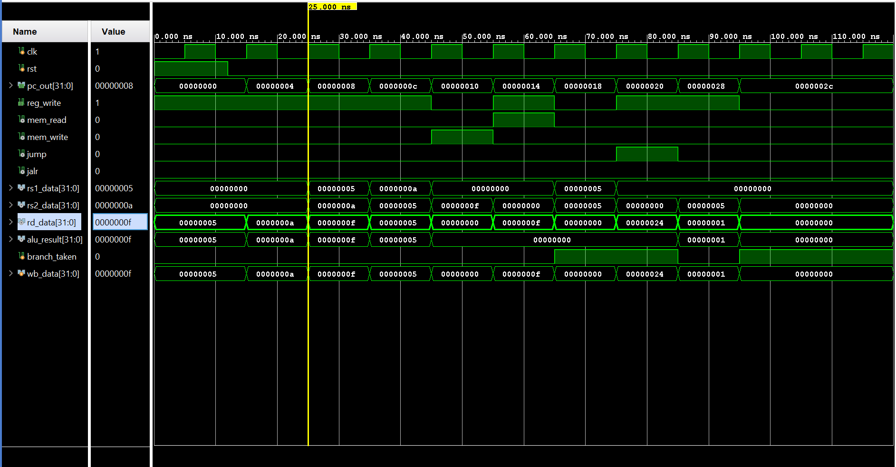

# RISC-V RV32I Single-Cycle Processor

A fully functional **32-bit RISC-V RV32I single-cycle processor** implemented in **Verilog HDL** and verified using a self-checking testbench in **Xilinx Vivado**.

## Overview

This project implements a basic RISC-V RV32I processor using a single-cycle architecture, where each instruction is completed within one clock cycle.

### Key Features

* 32-bit RV32I architecture
* Single-cycle datapath
* 32 × 32-bit register file
* ALU for arithmetic, logical, and comparison operations
* Instruction decoder and control unit
* Instruction and data memory
* Branch and jump support
* Load and store instructions
* Self-checking Verilog testbench
* Functional verification using Xilinx Vivado

## Architecture

The processor consists of the following modules:

| # | Module          | File             | Description                                               |
| - | --------------- | ---------------- | --------------------------------------------------------- |
| 1 | Program Counter | `pc.v`           | Updates the program counter                               |
| 2 | Register File   | `regfile.v`      | 32 × 32-bit registers with x0 hardwired to zero           |
| 3 | ALU             | `alu.v`          | Performs arithmetic, logical, and comparison operations   |
| 4 | Decoder         | `decoder.v`      | Decodes instruction fields and generates immediate values |
| 5 | Control Unit    | `control_unit.v` | Generates datapath control signals                        |
| 6 | Memory          | `memory.v`       | Instruction and data memory                               |
| 7 | Top Module      | `riscv_top.v`    | Integrates all processor modules                          |

### Datapath

```text
             +-------------+
             | Program     |
             | Counter     |
             +------+------+
                    |
                    v
             +-------------+
             | Instruction |
             |   Memory    |
             +------+------+
                    |
                    v
             +-------------+
             |  Decoder &  |
             | Control Unit|
             +------+------+
                    |
              +-----+-----+
              |           |
              v           v
        +-----------+   +-----------+
        | Register  |   | Immediate |
        |   File    |   | Generator |
        +-----+-----+   +-----------+
              |
              v
           +------+
           |  ALU |
           +--+---+
              |
       +------+------+
       |             |
       v             v
   Data Memory    Write Back
```

## Supported Instructions

| Category        | Instructions                                         |
| --------------- | ---------------------------------------------------- |
| R-Type          | ADD, SUB, SLL, SLT, SLTU, XOR, SRL, SRA, OR, AND     |
| I-Type          | ADDI, SLTI, SLTIU, XORI, ORI, ANDI, SLLI, SRLI, SRAI |
| Load            | LB, LH, LW, LBU, LHU                                 |
| Store           | SB, SH, SW                                           |
| Branch          | BEQ, BNE, BLT, BGE, BLTU, BGEU                       |
| Jump            | JAL, JALR                                            |
| Upper Immediate | LUI, AUIPC                                           |

## Instruction Execution

Each instruction follows the single-cycle datapath:

1. **Fetch** – The program counter addresses instruction memory.
2. **Decode** – Instruction fields and immediate values are decoded.
3. **Register Read** – Source registers are read from the register file.
4. **Execute** – The ALU performs the required operation.
5. **Memory Access** – Load and store instructions access data memory.
6. **Write Back** – The result is written to the destination register.
7. **PC Update** – The next PC is selected for sequential execution, branches, or jumps.

## Verification

The processor was verified using a **self-checking Verilog testbench** in Xilinx Vivado.

The test program verifies arithmetic operations, memory access, branch control, and jump execution.

### Verification Results

| Register | Expected | Obtained | Status |
| -------- | -------: | -------: | ------ |
| x1       |        5 |        5 | ✅ PASS |
| x2       |       10 |       10 | ✅ PASS |
| x3       |       15 |       15 | ✅ PASS |
| x4       |        5 |        5 | ✅ PASS |
| x5       |       15 |       15 | ✅ PASS |
| x6       |        0 |        0 | ✅ PASS |
| x7       |       36 |       36 | ✅ PASS |
| x8       |        0 |        0 | ✅ PASS |
| x9       |        1 |        1 | ✅ PASS |

### Testbench Output

```text
---------------------------------------------------
 RV32I Single-Cycle Processor - Verification Report
---------------------------------------------------
x1 (expect 5)            = 5
x2 (expect 10)           = 10
x3 (expect 15)           = 15
x4 (expect 5)            = 5
x5 (expect 15, from LW)  = 15
x6 (expect 0, skipped)   = 0
x7 (expect 36, JAL link) = 36
x8 (expect 0, skipped)   = 0
x9 (expect 1)            = 1

>>> TEST PASSED: all instructions executed correctly <<<
```

## Simulation Waveform

The processor was simulated and verified using **Xilinx Vivado**. The waveform was analyzed to verify instruction execution, ALU operations, register write-back, memory access, and branch/jump control.



## Project Structure

```text
riscv_rv32i_processor/
│
├── README.md
├── .gitignore
│
├── docs/
│   └── riscv_waveform.png
│
├── rtl/
│   ├── pc.v
│   ├── regfile.v
│   ├── alu.v
│   ├── decoder.v
│   ├── control_unit.v
│   ├── memory.v
│   └── riscv_top.v
│
├── tb/
│   └── riscv_tb.v
│
└── sim/
    ├── program.asm
    └── program.hex
```

## Tools Used

* **Verilog HDL**
* **Xilinx Vivado**
* **RISC-V RV32I ISA**
* **Simulation and waveform analysis**

## How to Run

1. Open **Xilinx Vivado**.
2. Create a new **RTL Project**.
3. Add all Verilog files from the `rtl/` folder as **Design Sources**.
4. Add `tb/riscv_tb.v` as a **Simulation Source**.
5. Add `sim/program.hex` as the simulation memory image.
6. Set `riscv_tb` as the simulation top module.
7. Run:

```text
Flow Navigator → Simulation → Run Behavioral Simulation
```

8. In the Tcl Console, run:

```tcl
restart
run 500 ns
```

9. Check the Tcl Console for the **TEST PASSED** message.
10. Add internal signals to the waveform viewer for detailed verification.

## Future Improvements

* Implement a 5-stage pipelined RV32I processor
* Add hazard detection and data forwarding
* Add more comprehensive instruction-level test programs
* Implement and test the processor on an FPGA board

## Author

**LALAM PAVANI**
B.Tech – Electronics & Communication Engineering

